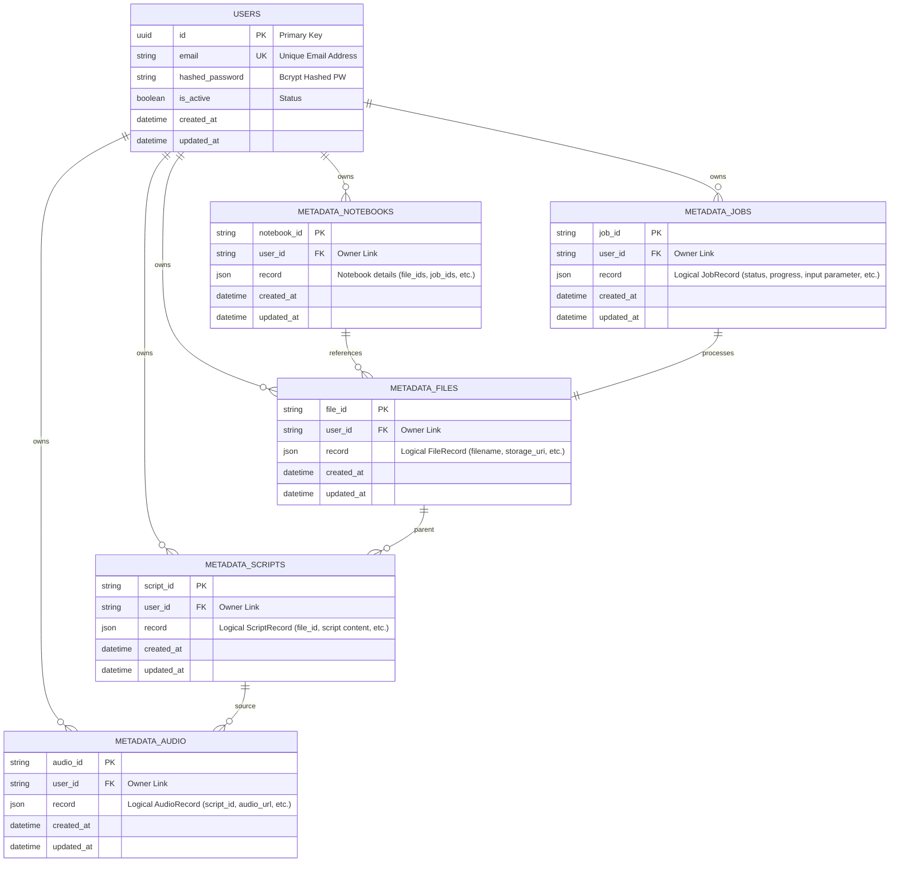

# Studycast Backend

**Studycast Frontend** → [GitHub](https://github.com/GDG-on-Campus-KNU/2026-Fortuna-FE)

> **이동 중 낭비되는 시간을 공부 시간으로 바꾸는, AI 팟캐스트 학습 앱**
>
> 사용자의 가용 시간과 선호 스타일에 맞춰 학습 자료를 맞춤형 팟캐스트와 암기송으로 변환해 주는 AI 기반 개인화 오디오 학습 솔루션.

| 홈 | 라이브러리 | 파일 | 플레이어 |
| --- | --- | --- | --- |
|  |  |  |  |

## 주요 기능

| #   | 기능                           | 설명                                               |
| --- | ------------------------------ | -------------------------------------------------- |
| 1   | 시간별 학습 밀도 자동 조절     | 5 / 10 / 20 / 30분 분량 자동 생성                  |
| 2   | 맞춤형 학습 포맷               | 스토리텔링 · 퀴즈 · 대화식                         |
| 3   | 오디오 플레이어                | 챕터 이동 · 구간 반복 · 0.75x ~ 2x 속도 · 오프라인 |
| 4   | 다양한 성격의 TTS              | 친구형 · 교수형 · 코치형                           |
| 5   | 사용자 자료 기반 스크립트 생성 | PDF / TXT 업로드, 출제 경향 반영                   |

## 기술 스택

- **Framework**: FastAPI
- **Database & ORM**: PostgreSQL, SQLAlchemy 2.0
- **Storage**: Google Cloud Storage (GCS)
- **AI & Speech**: Google Gemini
- **Package Manager**: uv
- **Infrastructure**: Docker Compose, Google Cloud Run

## 프로젝트 구조

```
.
├── app/                    # 메인 애플리케이션 소스 코드
│   ├── main.py             # FastAPI 앱 생성 및 미들웨어 설정
│   ├── api/                # 프레젠테이션 계층 (FastAPI 라우터 및 엔드포인트)
│   ├── application/        # 애플리케이션 시나리오 및 백그라운드 작업 처리기
│   ├── core/               # 글로벌 설정, DB 세션 관리, JWT 인증 및 의존성 주입
│   ├── domain/             # 비즈니스 도메인 규칙 및 데이터 모델 (Pydantic)
│   ├── infra/              # 인프라 계층 (Postgres, GCS, Gemini LLM, TTS 서비스 구현체)
│   ├── models/             # SQLAlchemy ORM 모델 (물리 DB 테이블 구조)
│   ├── repositories/       # 데이터 리포지토리 추상 인터페이스
│   ├── schemas/            # DTO 및 API 입출력 Pydantic 스키마
│   └── services/           # 비즈니스 서비스 로직 (인증 등)
├── docs/                   # 세부 개발 및 운영 가이드 문서
├── scripts/                # 배포 및 툴링 스크립트 폴더
└── tests/                  # 단위 및 통합 테스트 코드 폴더
```

## 시스템 아키텍처

<p align="center">
    
</p>

## ERD

데이터베이스 설계는 PostgreSQL의 강력한 RDBMS 관계 설정과 JSON 확장 스펙을 함께 활용하고 있습니다. 회원 관리(`users` 테이블)를 제외한 도메인 메타데이터는 대용량/비정형 문서 데이터 확장에 유연하게 대응하기 위해 JSON 컬럼 구조(`record`)의 메타데이터 테이블군으로 구현되어 있습니다.



- **Relational Mapping**: 테이블 간 관계 및 무결성은 DB 물리 레벨보다는 애플리케이션 서비스 계층에서 논리적 참조키(예: `user_id`, `file_id`, `script_id`)를 검증하여 관리합니다.
- **Index**: 잦은 필터 조회가 필요한 모든 메타데이터 테이블의 `user_id` 컬럼에 인덱스(`ix_metadata_*_user_id`)가 생성되어 있습니다.

## API 구조

| Method     | Path                                                  | Auth | Description                                             |
| :--------- | :---------------------------------------------------- | :--: | :------------------------------------------------------ |
| **POST**   | `/api/v1/auth/signup`                                 |  N   | 신규 사용자 등록 (회원가입)                             |
| **POST**   | `/api/v1/auth/login`                                  |  N   | OAuth2 패스워드 방식 로그인 및 JWT 토큰 발급            |
| **GET**    | `/api/v1/auth/me`                                     |  Y   | 현재 로그인한 사용자 프로필 조회                        |
| **POST**   | `/api/v1/auth/refresh`                                |  N   | 만료된 Access Token을 Refresh Token을 이용해 재발급     |
| **GET**    | `/api/v1/health`                                      |  N   | API 서버 헬스 체크 엔드포인트                           |
| **GET**    | `/api/v1/notebooks`                                   |  Y   | 사용자의 전체 노트북 목록 조회                          |
| **POST**   | `/api/v1/notebooks`                                   |  Y   | 신규 노트북(학습용 작업 공간) 생성                      |
| **GET**    | `/api/v1/notebooks/{notebook_id}`                     |  Y   | 특정 노트북 상세 정보 및 연동된 파일/오디오 목록 조회   |
| **DELETE** | `/api/v1/notebooks/{notebook_id}`                     |  Y   | 노트북 및 연동 리소스 전체 삭제                         |
| **POST**   | `/api/v1/notebooks/{notebook_id}/sources`             |  Y   | 노트북에 소스 파일(PDF/TXT) 업로드 및 텍스트 추출       |
| **DELETE** | `/api/v1/notebooks/{notebook_id}/sources/{source_id}` |  Y   | 노트북에서 특정 소스 파일 연동 해제 및 데이터 삭제      |
| **POST**   | `/api/v1/jobs`                                        |  Y   | AI 팟캐스트 오디오 생성 백그라운드 작업 요청            |
| **GET**    | `/api/v1/jobs/{job_id}`                               |  Y   | 팟캐스트 생성 작업의 진행 상태 및 에러 메시지 상세 조회 |
| **GET**    | `/api/v1/podcasts`                                    |  Y   | 생성 완료된 사용자의 전체 팟캐스트 리스트 조회          |
| **GET**    | `/api/v1/podcasts/{podcast_id}`                       |  Y   | 특정 팟캐스트 상세 정보 및 GCS Signed URL 조회          |
| **DELETE** | `/api/v1/podcasts/{podcast_id}`                       |  Y   | 생성된 팟캐스트 파일 및 메타데이터 삭제                 |

## 문서

프로젝트의 자세한 설정 및 사용 안내는 아래 문서들을 참고하세요.

- [Getting Started Guide](docs/getting-started.md) — 로컬 개발 환경 구성, 환경 변수 설정, Docker Compose 실행 및 테스트 방법
- [API Reference & Flow](docs/api.md) — 전체 API 흐름 시나리오 및 API 문서 연동 정보
- [Google Cloud Storage Design](docs/gcs.md) — GCS 내 폴더 구조 규격 및 Signed URL 만료 정책
- [Cloud Run Deployment Guide](docs/deployment.md) — Google Cloud Run 배포 사전 준비 및 스크립트 실행 방법

## Team Fortuna

| 이름   | 역할      | 담당 영역                    | GitHub                                           |
| ------ | --------- | ---------------------------- | ------------------------------------------------ |
| 정희균 | AN (팀장) | 오디오 플레이어 · API 테스트 | [@Segyun](https://github.com/Segyun)             |
| 전현준 | AN        | 데이터 모델 · 백엔드 연동    | [@conny3233](https://github.com/conny3233)       |
| 안소민 | AN        | UI 디자인 · 구현             | [@somin320](https://github.com/somin320)         |
| 박채빈 | BE        | API 설계 · 구현              | [@looksambrook](https://github.com/looksambrook) |
